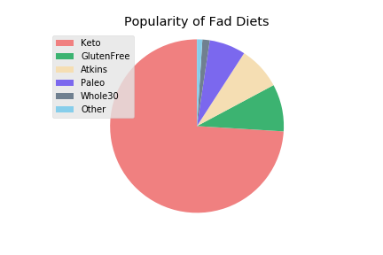
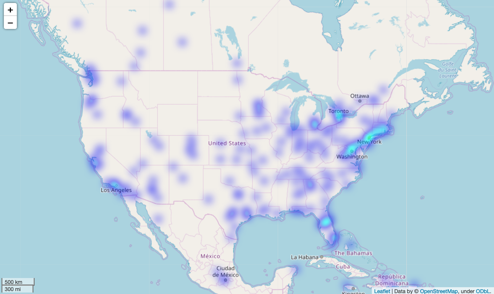
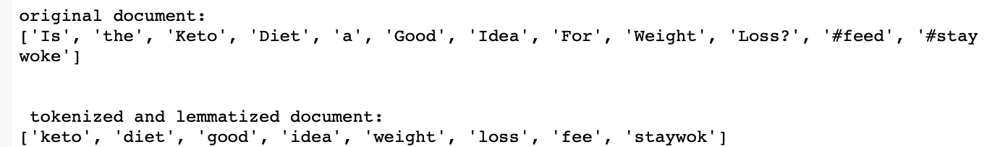
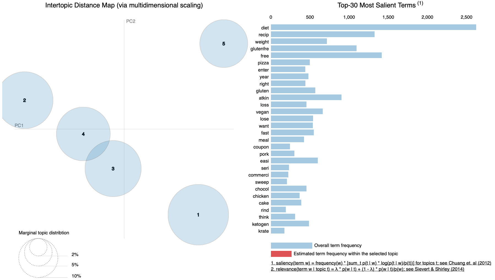
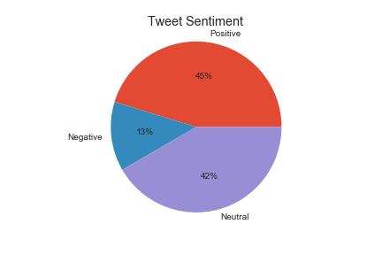

# Analyzing Fad Diet Tweets
Vinh Tran

### Link to Presentation
Keynote: https://drive.google.com/file/d/1eELvOFhvU7BpXIzDhOLDOIlTbJy5KrYq/view?usp=sharing

PDF: https://drive.google.com/file/d/1RrDwgiRb_zyAFHyjcw0eih1gRjDUZj0p/view?usp=sharing

# Table of Contents
- [Description](#Description)
- [Exploratory Data Analysis](#Exploratory-Data-Analysis)
- [Topic Modeling](#Topic-Modeling)
- [Sentiment Analysis](#Sentiment-Analysis)
- [Inferential Linear Regression](#Linear-Regression)
- [Conclusions and Next Steps](#Conclusions)

# Description

I have a background in nutrition. When I bring this up, one of the first questions I always get is, “What do you think about ...insert fad diet...?" Limitations of traditional nutrition research include: a large investment in money and time, involvement of human subjects, and not being agile enough to keep up with rapidly-changing trends. Measuring sentiment on social media is a way to guide research to overcome some of these limitation. From a public health perspective, investments can be made into diets that are shown to have an association with an outcome like obesity. From a marketing perspective, companies can glean insights on what consumers are interested in. The diet and weight loss industry in the US is estimated to be worth $72 billion dollars.

#### Goals and Questions:
(1) Perform topic modeling and sentiment analysis of "fad" diet tweets.  
- When people tweet about fad diets, what are the general topics they tweeting about? Is the tweet sentiment positive, negative or neutral?

(2) Determine if tweet sentiment is associated with city-level obesity rates.
- Given sufficient text, predict the personality type of the individual.


# Exploratory Data Analysis

Tweets were collected using the Twitter streaming API. So far, 97,816 tweets with the following "fad" diet keywords have been collected:  'keto','whole30','glutenfree','mediterraneandiet','lowfat', 'atkins', 'paleo', 'celeryjuice'
- Removing re-tweets leaves 53,176 tweets
- Removing non-English tweets leaves 43,716

- Keto is by far the most tweeted about diet


- Limiting to English and US only tweets leaves 1,494. Below is a map that shows where each tweet is coming from.


City level health outcomes come from the CDC 500 Cities Project, which includes outcomes like obesity, smoking and diabetes prevalence.

# Topic Modeling

First, the tweets are cleaned to remove stopwords, URLs, smileys, mentions and emojis using the preprocessor.

Then, stemming is performed using PorterStemmer. Below is a WordCloud of the most popular words.


Then, the tweets are tokenized. Here is an example of the tokenization.



Then I created the dictionary and the corpus for LDA using the gensim library.

I created a bag-of-words and also TF-IDF. Next I ran at Latent Dirichlet Allocation (LDA) using bag-of-words and TF-IDF.

### Bag-of-words
|Topic|Words|
|:---:|:---:|
|0|recip, paleo, carb, easi, chicken, glutenfre, delici, chees, bread, cooki|
|1|free, glutenfre, gluten, vegan, food, cake, chocol, sugar, friendly, carb|
|2|pizza, year, enter, right, want, fast, free, pork, coupon, seri|
|3|diet, atkin, weight, lose, loss, go, help, think, week, work|
|4|diet, recip, meal, ketogen, paleo, look, like, healthi, love, plan|

### TF-IDF
|Topic|Words|
|:---:|:---:|
|0|free, thank, atkin, latest, pizza, right, gluten, daili, glutenfre, coupon |
|1|diet, paleo, recip, work, atkin, drink, review, carb, like, chicken |
|2|diet, lose, weight, go, week, help, ketosi, ketogen,  know, carb |
|3|food, loss, best, look, fast, avail, ketodiet, good, need, begin|
|4|glutenfre, paleo, vegan, food, friendli, recip, chocol, year, want, cooki|


To measure model perplexity (how good the model is) I calculated the perplexity score. The lower the better.

Perplexity bow:  -6.618952989869589
Perplexity tfidf:  -7.571086243363428

Since the tf-idf model seemed to perform better, I used this to visualize the topics. The larger the bubble, the more prevalent the topic. Ideally topics are big, non-overlapping and distributed throughout the quadrants.




For the TF-IDF model, topics can be broken down into: cooking, feel-good diets, weight-loss, health, indulgences.

# Sentiment Analysis

TextBlob was used to score each tweet, calculating a polarity and sentiment.



### Naive Bayes Classifier
Accuracy = 0.774869109947644

# Linear Regression

I then performed a linear regression to answer the question, "Are positive tweets associated with obesity?" The postulation is that if people tweet more positively about a fad diet they are on a diet seeking to lose weight.

I did the analysis at the city level. I aggregated tweet sentiment to the city level (number of tweets with location data and in the US results in 1,494 tweets) and merged to the 2018 CDC 500 cities datafile which includes a series of variables on health measures such as obesity, CHD, diabetes, and smoking prevalence among others. In order to do this, I first had to find the nearest major city given a set of coordinates for each tweet. Then, I merged my twitter data to the CDC 500 cities data by city. My resulting data had 294 observations. 221 of these observations had positive tweet values.

### Results

The linear regression shows that positive tweet sentiment has no association with obesity rates.


# Conclusion and Next Steps

Topic modeling and sentiment analysis are useful tools in understanding why people may be tweeting about fad diets. Interpreting the distinct topics is a skill and requires domain knowledge. Overall, there were more positive and neutral tweets than negative tweets. I created a Naive Bayes classifier with 70 percent accuracy. Interestingly, positive tweets are not shown to be correlated with obesity prevalence rates at all.

One limitation of my data are that tweets with location data make up a very small percentage of overall tweets about fad diets and may not be representative of the population since people have to opt-in to share location data. Additionally, the CDC dataset is only limited to the 500 largest cities which represent ~1/3 of the population. Thus, rural areas are not represented in this data. The tweets being mapped to major cities may be coming from rural areas. Also, there were much fewer negative tweets which led to unequal classes impacting the Naive Bayes Classifier.

### Next Steps
- I did not consider emoji's in the sentiment analysis but increasingly emoji's are a main way of communicating.
- Need more data! Continuously collect more tweets on AWS, utilize Spark.
- Combine with city level demographic data.
- My Capstone 3 goal is to make a prediction on how positively fad diets are perceived in a city. This can be generalized to understand how certain markets respond to fad diets.


<a href="#Analyzing-Fad-Diet-Tweets">Back to top</a>

```python

```
