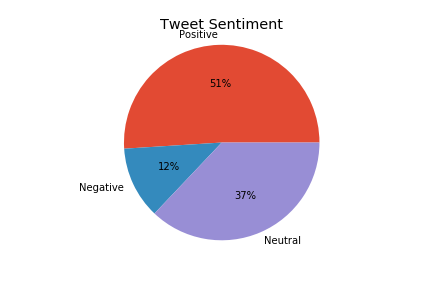

# Analyzing Fad Diet Tweets
Vinh Tran

### Link to Presentation
Keynote: https://drive.google.com/file/d/1eELvOFhvU7BpXIzDhOLDOIlTbJy5KrYq/view?usp=sharing

PDF: https://drive.google.com/file/d/1RrDwgiRb_zyAFHyjcw0eih1gRjDUZj0p/view?usp=sharing

# Table of Contents
- [Description](#Description)
- [Exploratory Data Analysis](#Exploratory-Data-Analysis)
- [Topic Modeling](#Topic-Modeling)
- [Sentiment Analysis](#Sentiment-Analysis)
- [Inferential Linear Regression](#Linear-Regression)
- [Conclusions and Next Steps](#Conclusions)

# Description

I have a background in nutrition. When I bring this up, one of the first questions I always get is, “What do you think about <insert fad diet>?" Limitations of traditional nutrition research include: a large investment in money and time, involvement of human subjects, and not being agile enough to keep up with rapidly-changing trends. Measuring sentiment on social media is a way to guide research which overcomes these limitation. From a public health perspective, investments can be made into diets that are shown to have an association with an outcome like obesity. From a marketing perspective, companies can glean insights on what consumers are interested in. The diet and weight loss industry in the US is estimated to be worth $72 billion dollars.

#### Goals and Questions:
(1) Perform topic modeling and measure sentiment of "fad" diet tweets.  
- When people tweet about fad diets, what are the general topics they tweeting about? Is the tweet sentiment positive, negative or neutral?

(2) Determine if tweet sentiment is associated with city-level obesity rates.
- Given sufficient text, predict the personality type of the individual.


# Exploratory Data Analysis

Collected 97,816 fad diet tweets with keywords:  'keto','whole30','glutenfree','mediterraneandiet','lowfat', 'atkins', 'paleo', 'celeryjuice'

Removing re-tweets leaves 53,176 tweets.

Number of tweets with location data leaves 2,692 tweets.

Keto is by far the most tweeted about diet as shown in this


Limiting to english and US only leaves 1,494


# Topic Modeling
First, the tweets are cleaned to remove URLs, smileys, mentions and emojis using the preprocessor

Then, stemming is performed using PorterStemmer. Below is a WordCloud of the most popular words.


Next, the tweets are tokenized and lemmatized. Here is an example of the stemming.


I create a bag-of-words and also TF-IDF using gensim. Then I ran at Latent-dirichlet analysis (LDA) using bag-of-words and TF-IDF.

Bag-of-words
|Topic|Words|
|:---:|:---:|
|0|[glutenfre, vegan, coffe, time, thank, happi, come, free, dinner, tonight|
|1|[diet, good, weight, loss, idea, fee, love, meal, free, best|
|2|[atkin, diet, carb, lose, like, great, peopl, food, week, today|
|3|[diet, work, know, friendli, go, review, dinner, cauliflow, chicken, carb|
|4|[week, right, paleo, fast, sugar, bread, make, feel delici, look|

| - | type | posts |
|:---:|:---:|:---:|
| 0 | INFJ | 'http://www.youtube.com/watch?v=qsXHcwe3krw|||...'|
| 1 | ENTP | 'I'm finding the lack of me in these posts ver..' |
| 2 | INTP | 'Good one _____ https://www.youtube.com/wat...' |
| 3 | INTJ | 'Dear INTP, I enjoyed our conversation the o... '|
| 4 | ENTJ | 'You're fired.|||That's another silly misconce... '|


TF-IDF
|Topic|Words|
|:---:|:---:|
|0|[go, chicken, dinner, fast, think, tri, recip, diet, right, best |
|1|[diet, paleo, know, thank, great, day, vegan, time, feel, meal |
|2|[good, weight, idea, loss, diet, fee, like, ,love glutenfre, help |
|3|[food, come, friendli, happi, health, thing, father, ketodiet, work, ketogen|
|4|[atkin, glutenfre, week, carb, bread, today, coffe, lose, delici, chocol|

It looks like topics can be broken down into happiness, weight-loss, carbs, ingredients, and deliciousness.

# Sentiment Analysis

TextBlob was used to score each cleaned and stemmed tweet calculating a polarity and sentiment.



### Ask Hamid about Naive Bayes Classifier

# Linear Regression
I then performed a linear regression to answer the question, "Are positive, negative or neutral tweets associated with obesity?" The postulation is that if people tweet more positively about a fad diet they are more interested and engaged in their health and therefore more likely to be a healthy weight. I did the analysis at the city level. I aggregated tweet sentiment to the city level and merged to the 2018 CDC 500 cities datafile which includes a series of variables on health measures such as obesity, CHD, diabetes, and smoking prevalence among others.

To do this, I first had to find the nearest major city given a set of coordinates for each tweet. Then, I merged my twitter data to the CDC 500 cities data by city. My resulting data had 294 observations.

## Feature Selection
Since the CDC 500 data contains health measures that are highly correlated with each other, I only included variables that were not highly correlated. These were:

My R-squared = 0.890

Do I need to do other diagnostics???


# Conclusion and Next Steps

- Topic modeling and sentiment analysis are useful tools in understanding why people may be tweeting about fad diets. It was harder to interpret the distinct topics. There were more positive and neutral tweets than negative tweets. More interestingly, these tweets are shown to be correlated with obesity prevelance rates. One limitation of my data are that tweets with location data make up a very small percentage of overall tweets about fad diets and may not be representative of the population since people have to opt-in to share location data. Additionally, the CDC dataset is only limited to the 500 largest cities which represent ~1/3 of the population. Thus, rural areas are not represented in this data. The tweets being mapped to major cities may be coming from rural areas.

Next Steps
- I did not consider emoji's in the sentiment analysis but increasingly emoji's are a main way of communicating.
- My Capstone 3 goal is to make a prediction on how positively fad diets are perceived in a city. This can be generalized to understand how certain markets respond to fad diets.


<a href="#Analyzing-Fad-Diet-Tweets">Back to top</a>

```python

```
